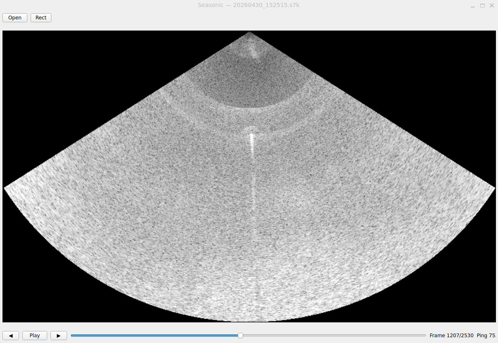

# Seasonic



S7K sonar file viewer for Norbit WBMS water column data. Plays back record 7042 (water column) frames with rectangular and fan (sector) projection modes.

## Features

- Rectangular and fan projection views
- Playback with play/pause, frame stepping, and scrubbing
- Keyboard shortcuts: Space (play/pause), Left/Right (step), Home/End, Ctrl+O (open)
- Log-scaled intensity normalisation

## Getting started

### Option 1: Docker (no local dependencies)

Builds a container with all Qt/Wayland dependencies. Mounts your home directory read-only so you can open S7K files from the file dialog.

```bash
docker compose -f docker/docker-compose.yml build
```

Then launch with either:

```bash
./seasonic.sh
# or
docker compose -f docker/docker-compose.yml run --rm seasonic
```

### Option 2: Local install

Requires Python 3.10+.

```bash
pip install -e .
seasonic
```

## S7K Parser

`s7k_parser.S7KFile` reads Reson S7K files using a registry-based record parser. Adding support for a new record type:

```python
from s7k_parser import register_record, S7KRecord

@register_record(7004)
class BeamGeometryRecord(S7KRecord):
    __slots__ = ('beam_angles',)

    def __init__(self, file_offset, beam_angles):
        super().__init__(file_offset)
        self.beam_angles = beam_angles

    @classmethod
    def parse(cls, raw, file_offset):
        # extract fields from raw bytes
        ...
```

The file scanner automatically picks up registered record types with no changes to `S7KFile`.

## License

AGPL-3.0
